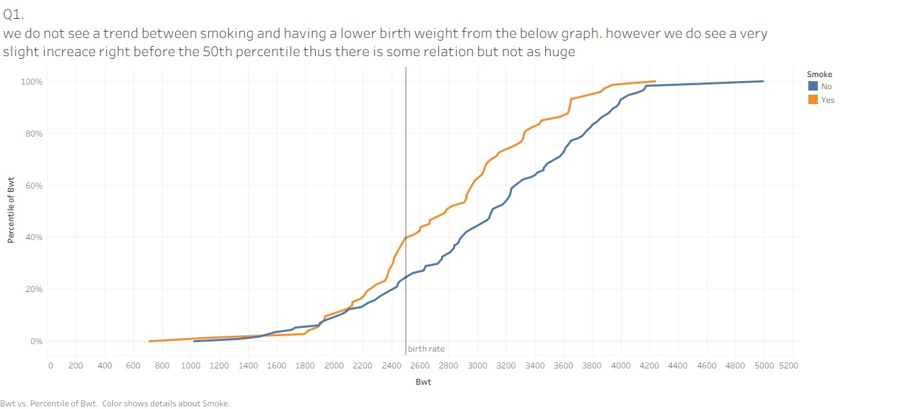
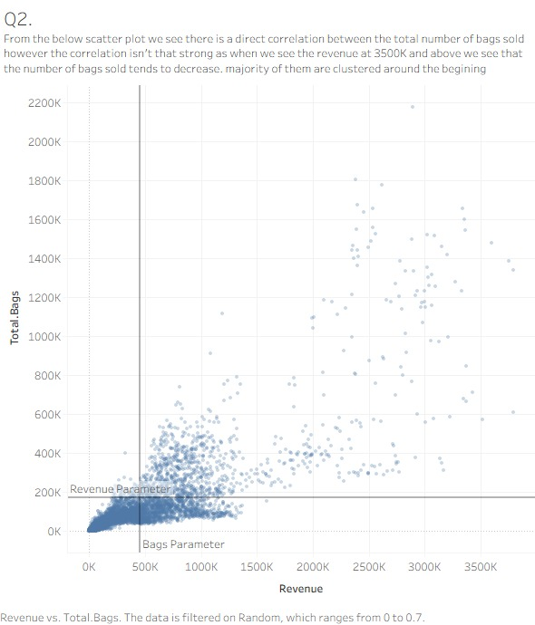
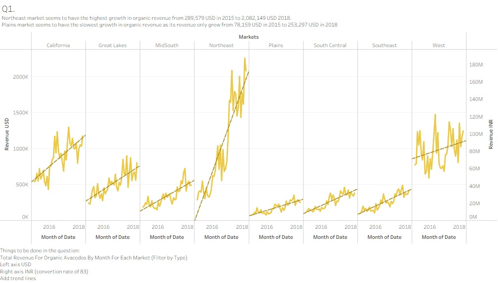
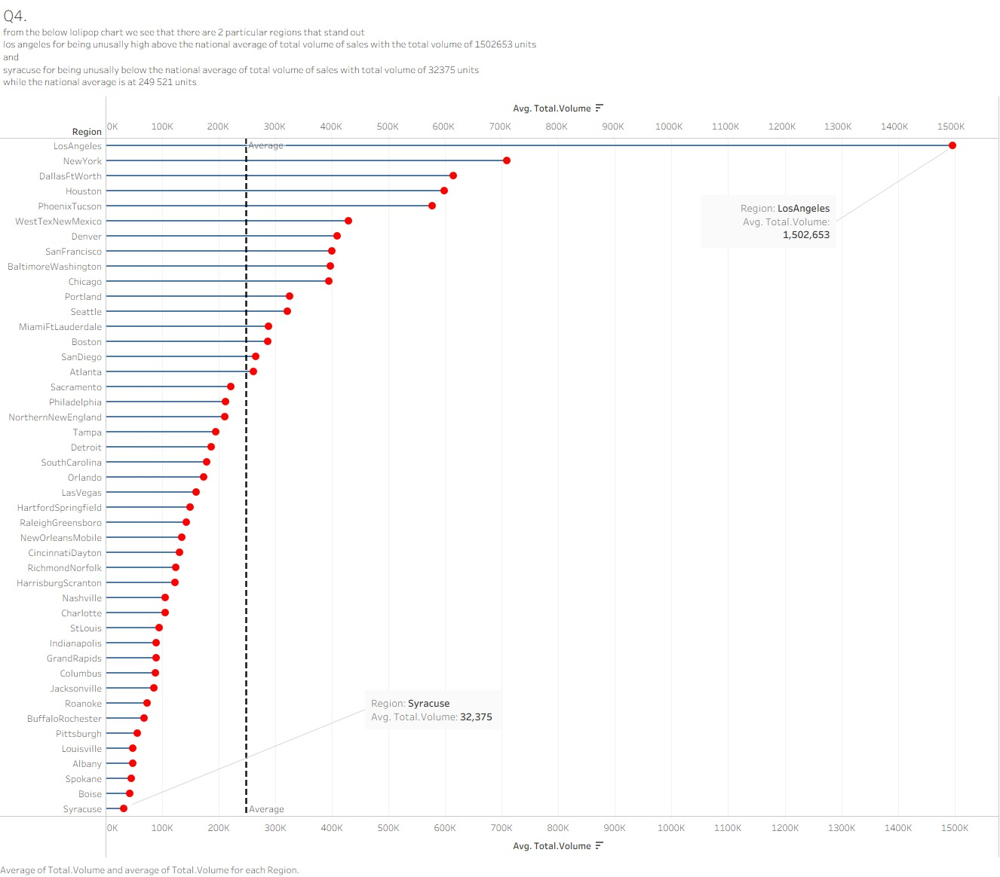
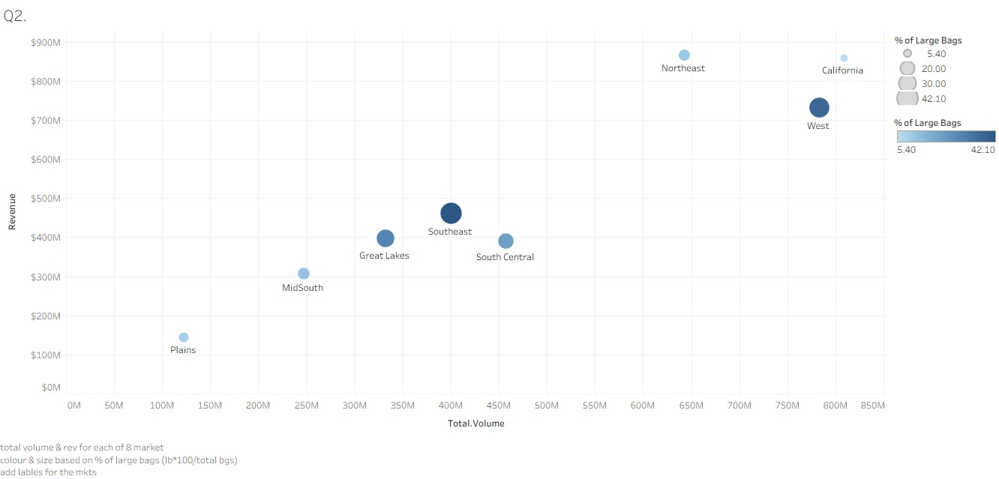
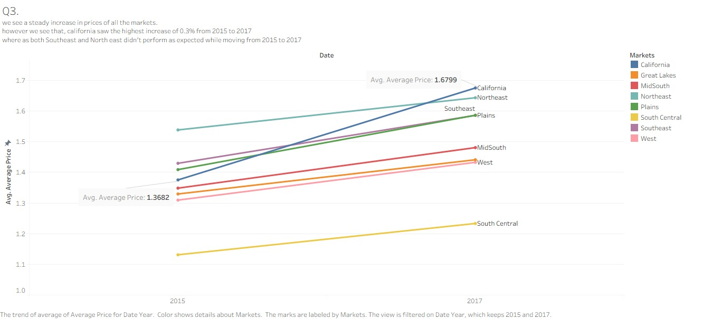
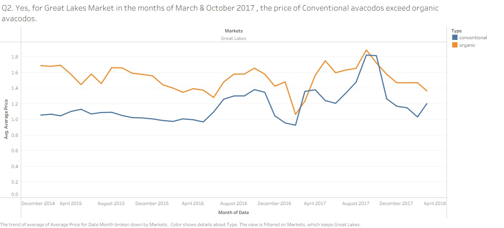
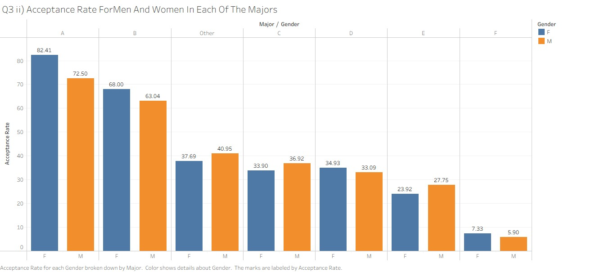
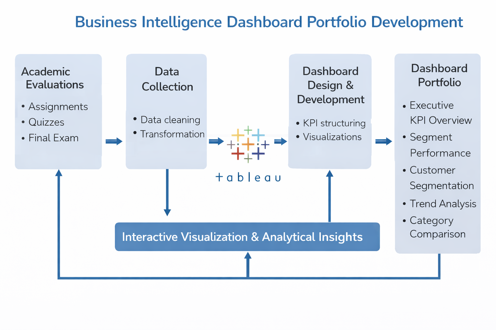

# Business Intelligence & Data Visualization Portfolio (Tableau)

This repository contains a structured collection of **Tableau dashboards developed across multiple academic evaluations**, including:

- Quiz 1  
- Quiz 2  
- Individual Assignment  
- Final Examination  

Each set of dashboards was built independently under evaluation conditions to solve a specific business problem using data visualization and analytical reasoning.

Rather than a single project, this repository demonstrates **consistency in analytical thinking across multiple business contexts**.

---

## Portfolio Structure

The dashboards included in this repository were created as part of graded assessments and represent:

- KPI-driven executive dashboards
- Sales and profitability analysis
- Regional performance evaluation
- Customer segmentation insights
- Operational trend and time-series analysis

Each evaluation required:
- Independent problem framing
- Metric selection
- Data cleaning and preparation
- Visual storytelling under time constraints

---

## Representative Dashboards

Below are selected high-impact dashboards from across quizzes, assignments, and final examination builds.

---

---

---

---

---

---

---

---

## Skills Demonstrated

- Business problem interpretation under evaluation settings
- KPI identification and metric alignment
- Dashboard structuring for executive readability
- Multi-level filtering and drill-down interactions
- Comparative and trend-based performance analysis
- Insight extraction under time-bound constraints
- Data storytelling for business decision-making

---

## Analytical Workflow Followed

Across quizzes, assignments, and the final exam, a consistent analytical framework was applied:

### Workflow Stages

1. Business Objective Clarification  
2. KPI & Metric Identification  
3. Data Preparation & Cleaning  
4. Exploratory Data Analysis  
5. Dashboard Structuring & Interaction Design  
6. Insight Communication  

This demonstrates structured BI development rather than isolated visual builds.

---

## How to View the Dashboards

1. Download any `.twbx` file from the `/dashboards` folder.
2. Open using Tableau Desktop.
3. Navigate between worksheet and dashboard tabs.
4. Use filters and drill-down interactions to explore insights.

---

## Key Takeaways

- Strong BI work requires structured thinking beyond visual aesthetics  
- KPI framing drives meaningful business interpretation  
- Interactive dashboards improve executive usability  
- Consistent methodology across multiple evaluation settings demonstrates analytical maturity  

This repository reflects applied Business Intelligence development using Tableau across multiple formal evaluations.
